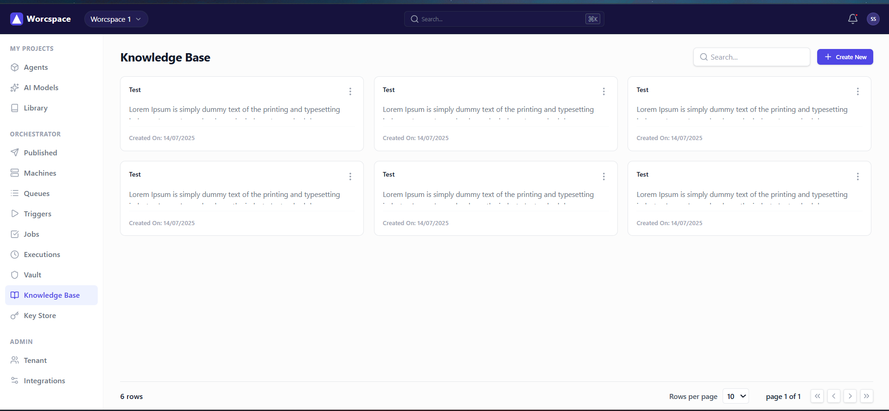
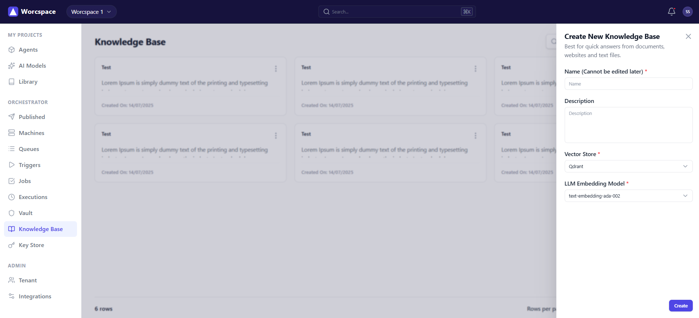

# Front-end Assignment: React UI

This is a responsive web application built for the front-end assignment. I replicated the provided Figma designs for the Knowledge Base screen.

## Technologies Used
- React (Functional components + Hooks)
- Vite for fast development
- Tailwind CSS (configured carefully with the required `#4F46E5` and `#1E1B4B` colors)
- TypeScript

## How to run the project

1. Clone the repository and `cd` into the folder.
2. Make sure you have Node.js installed.
3. Run `npm install` to install all necessary packages.
4. Run `npm run dev` to start the local development server.

## Features Implemented
- The **Knowledge Base Home Screen** is fully implemented with a grid layout and pagination footer.
- The **"Create New" button** is clickable and opens the right-aligned side panel exactly as shown in the second screen mockup.
- **Component Based Architecture**: I broke the UI down into clean, reusable pieces like `Header`, `Sidebar`, `Button`, `InputField`, and `KnowledgeBaseCard`.
- **Responsive Design**: The sidebar collapses into a hidden hamburger menu on mobile screens to ensure the app looks good on all devices.

## Screenshots

### Home Screen

### Create New Panel

